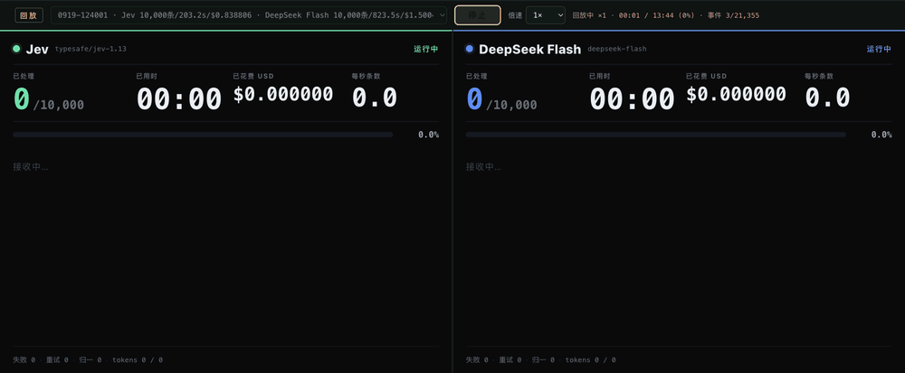

<p align="center">
  
</p>

# Jev Arena

**同一批评论，两侧模型，逐条对比。** 导入 CSV / Excel，配置两侧 API，实时观察打标速度、标签和费用，保存后随时回放。



**原速前 20 秒，无加速。** 直接点击项目的回放按钮，以 **1×** 录制已有的一万条评论对决，观察左右两侧处理数量和滚动速度的差异。[演示来源](assets/readme/demo.md) · [静态关键帧](assets/readme/demo-still.png)

最初用于 **Jev 与 DeepSeek 的评论分析演示**，现在两侧均可独立选择 Jev Decisions 或 OpenAI 兼容聊天接口。内置 **20 条合成评论**，启动服务不会调用模型。上图是一场历史运行，速度差异不代表所有任务的通用结论。

## 演示数据与完整报告

[一万条评论与分析上下文](examples/demo/README.md) · [可直接阅读的比较报告](examples/demo/0919-124001/report.md) · [Jev 完整报告](examples/demo/0919-124001/report.jev.html) · [DeepSeek 完整报告](examples/demo/0919-124001/report.deepseek.html)

资料包含原始 CSV、两侧逐条 JSONL 标签、机器可读统计与完整报告视图，方便你或 AI Agent 复核。HTML 可下载后打开；启动项目后也能直接在报告页切换阅读，无需 Key、无需重跑。

## 五分钟开始

需要 **Node.js 22 或更高版本**。拥有仓库访问权限后，克隆并启动：

```bash
git clone https://github.com/NanmiCoder/jev-arena.git
cd jev-arena
npm ci
npm start
```

打开 [本地对决场](http://localhost:5173)，展开「模型设置与评论导入」：

1. 填写两侧的协议、API Base URL、模型 ID 和 API Key，点击「保存模型配置」。
2. 使用内置示例，或选择自己的 `.csv` / `.xlsx` 评论文件。
3. 保持「本次条数」为 **20**，点击「开始对决」。两侧处理相同的前 20 条评论。
4. 有已保存的 VoxAgent 完整报告时，点击「查看双侧报告」，在页面顶部切换阅读两侧的研究结论与原文证据。
5. 完成后在回放栏选择本次录像，播放或调整倍速。**回放不调用模型。**

网页配置保存在服务端内存，重启后需重新填写。API Key 不写入录像，也不保存在浏览器 localStorage。如需持久配置，把 [.env.example](.env.example) 复制为 `.env` 后填写，再重启服务。

## 接入哪些接口？

| 模式 | Base URL 示例 | 模型 ID |
| --- | --- | --- |
| Jev Decisions | `https://openrouter.ai/api` | `typesafe/jev-1.13`（以账号实际可用为准） |
| DeepSeek / OpenAI 兼容 | `https://api.deepseek.com` | 服务商提供的模型 ID |
| OpenRouter 聊天 | `https://openrouter.ai/api/v1` | 服务商提供的 `组织/模型` ID |
| 其他 OpenAI 兼容服务 | 提供商指定地址，通常以 `/v1` 结尾 | 服务商提供的模型 ID |

**Jev 的 Decisions 是独立协议，不是 Chat Completions。** 选择 `jev` 时调用 `/alpha/decisions`；选择 `openai` 时调用 `/chat/completions`。也接受这两个接口的完整 URL。

聊天模式要求支持非流式 `messages` 请求，并能够输出符合提示词的 JSON 标签。若服务不支持 `response_format`，取消勾选 JSON mode。接口格式兼容不代表所有模型参数或输出能力完全相同；本项目不支持 Responses API、工具调用协议或自动发现模型。

左右两侧可以使用不同供应商、同一供应商的不同模型，或相同模型。界面与录像会记录实际配置的名称和模型 ID；内部 `jev` / `deepseek` 只是历史沿用的左右侧标识。

## 评论文件格式

下载 [CSV 示例](examples/comments.csv) 或 [Excel 示例](examples/comments.xlsx)。CSV 使用 UTF-8，可带 BOM；Excel 读取第一张工作表，首行为列名。

```csv
comment_id,content,platform,like_count,topic_title
001,回答速度挺快的,example,3,AI 模型体验
002,复杂问题还是会答错,example,1,AI 模型体验
```

| 列 | 要求 |
| --- | --- |
| `comment_id` | 必需，非空且唯一。Excel 中建议设为文本，保留前导零。 |
| `content` | 必需，非空评论正文。CSV 中的逗号、换行须按 CSV 规则加引号。 |
| `platform` | 可选，用于展示来源分布。 |
| `like_count` | 可选，数字。 |
| `topic_title` | 可选，传给模型的主题上下文。 |

网页上传最多 10 MB。旧版 `.xls` 请另存为 `.xlsx`；公式单元格请转换为值。导入只校验数据，不调用模型；文件错误会保留上一次有效数据。上传数据只保存在当前服务内存，重启后恢复 `DATA_PATH` 指定文件。

当前标签与提示词面向 **AI 模型 / 产品评论**。用于其他领域时，需调整 [受控词表](src/vocab.mjs) 和两个 [模型适配器](src/backends)，否则「相关性」等标签的语义不适用。

## 运行、费用与回放

- 默认每侧 20 条；超过 30 条需要明确确认。停止会取消在途请求，但供应商已处理的请求可能仍收费。
- 两侧各自并发、按批处理。解析失败可能拆批重试，实际请求次数和费用可能增加。
- API 返回 `usage.cost` 时使用其值；否则使用设置中的输入 / 输出美元单价估算。**未配置单价的 $0 表示费用未知，不是免费。** 估算不包含供应商折扣、缓存分档或失败请求账单。
- 结果保存在 `runs/<runId>/`：`manifest.json`（模型和运行信息）、`events.jsonl`（录像）、`labels.*.jsonl`（逐条结果）、`report.json`（比较报告）。
- 回放只读取事件文件，不需要 Key；重启服务后仍可从录像列表播放。原有录像格式保持兼容。
- 新网页流程每次新建运行，不续写旧任务，避免切换数据或模型后混用结果。

Jev 的引文由程序从原文机械摘取，聊天模型的引文由模型输出后逐字校验；每条结果通过 `meta.evidenceSource` 区分。两侧标签的一致率不是准确率，速度和费用也不能替代人工质量评估。

## 开发与验证

```bash
npm test
```

测试使用本地模拟模型服务与 20 条评论，覆盖 CSV / Excel、配置、双侧运行、录像回放和密钥不出现在结果中的检查；不调用付费 API。真实供应商兼容性需要自行小样本验证。

服务默认仅监听 `127.0.0.1`，适合个人本地使用，没有多用户认证。不要直接部署到公网。`.env`、`data/`、`runs/` 与上传目录已加入 [.gitignore](.gitignore)；一万条演示样本与报告单独整理在 `examples/demo/`；本地完整录像不随仓库上传。

`report/` 和 `src/review.mjs` 等历史演示脚本保留供研究参考，含原 Jev / DeepSeek 演示假设，不属于通用网页快速启动流程。

## 开源发布状态

项目当前以私有仓库维护：[NanmiCoder/jev-arena](https://github.com/NanmiCoder/jev-arena)。许可证尚未确定，正式开源前会补充 `LICENSE`。仓库包含演示 GIF、合成示例及明确整理的历史评论样本与报告，不包含本地 Key 或完整事件录像。
